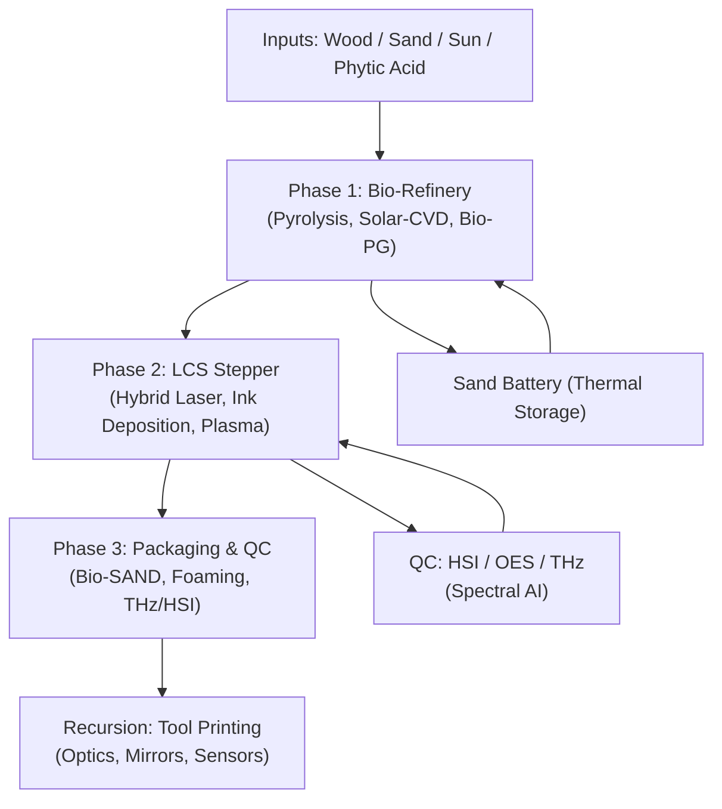
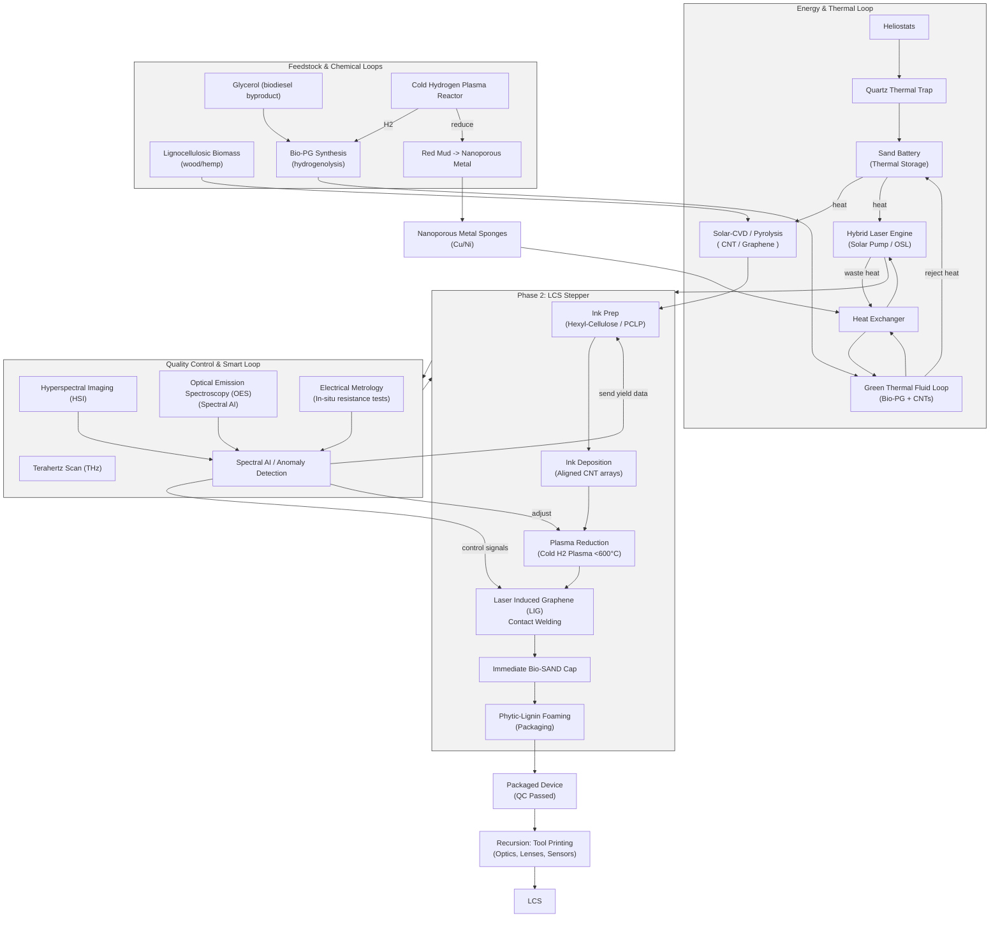

---
kernelspec:
  display_name: Python 3
  language: python
  name: python3
---

# paper.myst.md_chat1.copilot

## Contents

* [Synergistic Process for Fabricating Carbon-Based Electronic and Photonic Components](#synergistic-process-for-fabricating-carbon-based-electronic-and-photonic-components)
  * [Phase 1: Sustainable Feedstock & Synthesis](#phase-1-sustainable-feedstock-synthesis)
  * [Phase 2: Material Processing & Safety (The "Ink")](#phase-2-material-processing-safety-the-ink)
  * [Phase 3: Device Fabrication & Bandgap Engineering](#phase-3-device-fabrication-bandgap-engineering)
  * [Phase 4: Integration & Architecture](#phase-4-integration-architecture)
  * [Conclusion](#conclusion)
  * [Phase 5: Packaging & Preservation (The "Phytic Shield")](#phase-5-packaging-preservation-the-phytic-shield)
  * [Phase](#phase)
  * [Thermal Management Strategy](#thermal-management-strategy)
* [Synergistic Process for Fabricating Carbon-Based Electronic and Photonic Components](#synergistic-process-for-fabricating-carbon-based-electronic-and-photonic-components)
  * [Phase 0: Hybrid Energy Core (Optional)](#phase-0-hybrid-energy-core-optional)
  * [Phase 1: Sustainable Feedstock & Synthesis](#phase-1-sustainable-feedstock-synthesis)
  * [Phase 2: Material Processing & Safety (The "Ink")](#phase-2-material-processing-safety-the-ink)
  * [Phase 3: Device Fabrication & Bandgap Engineering](#phase-3-device-fabrication-bandgap-engineering)
  * [Phase 4: Integration & Architecture](#phase-4-integration-architecture)
  * [Thermal Management Strategy](#thermal-management-strategy)
  * [Phase 5: Packaging & Preservation (The "Phytic Shield")](#phase-5-packaging-preservation-the-phytic-shield)
  * [v6.3: Pine-Tree Foundry — Solar-Powered Monolithic Lignin Fab](#v63-pine-tree-foundry-solar-powered-monolithic-lignin-fab)
    * [Key Inputs](#key-inputs)
    * [High-level Process Flow](#high-level-process-flow)
    * [Safety & Yield Highlights](#safety-yield-highlights)
    * [Mermaid Diagram (Process Overview)](#mermaid-diagram-process-overview)
  * [Conclusion](#conclusion)
* [Synergistic Process for Fabricating Carbon-Based Electronic and Photonic Components](#synergistic-process-for-fabricating-carbon-based-electronic-and-photonic-components)
  * [Phase 0: Hybrid Energy Core (Optional)](#phase-0-hybrid-energy-core-optional)
  * [Phase 1: Sustainable Feedstock & Synthesis](#phase-1-sustainable-feedstock-synthesis)
  * [Phase 2: Material Processing & Safety (The "Ink")](#phase-2-material-processing-safety-the-ink)
  * [Phase 3: Device Fabrication & Bandgap Engineering](#phase-3-device-fabrication-bandgap-engineering)
  * [Phase 4: Integration & Architecture](#phase-4-integration-architecture)
  * [Thermal Management Strategy](#thermal-management-strategy)
  * [Phase 5: Packaging & Preservation (The "Phytic Shield")](#phase-5-packaging-preservation-the-phytic-shield)
  * [v6.3: Pine-Tree Foundry — Solar-Powered Monolithic Lignin Fab](#v63-pine-tree-foundry-solar-powered-monolithic-lignin-fab)
    * [Key Inputs](#key-inputs)
    * [High-level Process Flow](#high-level-process-flow)
    * [Safety & Yield Highlights](#safety-yield-highlights)
    * [Mermaid Diagram (Process Overview)](#mermaid-diagram-process-overview)
    * [v6.3 Expanded Process Diagram (Detailed)](#v63-expanded-process-diagram-detailed)
  * [Conclusion](#conclusion)

---
chat_input: true
---
# Prompt: 1

---
chat_input: true
---
Summarize these with the goal of producing a synergistic process for fabricating semiconducting electronic and photonic components

---
chat_input: true
---
# Prompt: 2

---
chat_input: true
---
@agent Enable: "Enable Gemini 3 Pro (Preview) for all clients"

# Response: 2

# Synergistic Process for Fabricating Carbon-Based Electronic and Photonic Components

This document outlines a holistic manufacturing process that synthesizes recent findings on graphene, carbon nanotubes (CNTs), and sustainable fabrication methods. The goal is to establish a closed-loop, low-toxicity pipeline for high-performance logic and power devices.

## Phase 1: Sustainable Feedstock & Synthesis
**Concept:** Shift from extractive mining (silicon/copper) to atmospheric harvesting.
*   **Source:** On-site Carbon Capture utilization. CO2 is harvested and converted directly into carbon allotropes (Graphene and CNTs) at the fab site.
*   **Benefit:** Eliminates raw material transport costs and supply chain constraints (e.g., sand purity, neon shortages).

## Phase 2: Material Processing & Safety (The "Ink")
**Concept:** Mitigate toxicity and ensure electronic purity through liquid-phase processing.
*   **Safety Strategy:** To prevent inhalation risks associated with High Aspect Ratio Nanomaterials (HARN), all nanomaterials are processed via **liquid-phase exfoliation**. This keeps particulates out of the air.
*   **Semiconductor Sorting (The Bandgap Solution):**
    *   *Challenge:* Raw CNTs are a mix of metallic and semiconducting tubes.
    *   *Solution:* Use **rigid, helical conjugated polymers** (e.g., PFO-BPy or P3HT) to selectively wrap and isolate semiconducting CNTs.
    *   *Note:* Avoid disordered polymers like lignin vitrimers for active logic, as their amorphous nature creates scattering sites that degrade transistor performance.
*   **Doping Precursors:** Utilize **Graphene Oxide (GO)** as a base material. Its oxygen functional groups naturally provide p-type doping.

## Phase 3: Device Fabrication & Bandgap Engineering
**Concept:** Additive manufacturing on sustainable substrates.
*   **Substrates:** Replace non-degradable FR4/Silicon with biodegradable alternatives such as **Cellulose Nanofibrils (CNF)**, **Silk Fibroin**, or water-soluble **phosphate glass**.
*   **Patterning:** Utilize **Nanoimprinting** and **Maskless Lithography** to reduce chemical waste compared to traditional subtractive etching.
*   **Junction Formation (Logic & Rectifiers):**
    *   **Graphene P-N Junctions:** Create rectifiers by starting with a p-type Graphene Oxide sheet. Use a physical mask and **Hydrogen Plasma** to selectively reduce specific regions. These reduced regions (rGO) become n-type (or less p-type), forming a seamless p-n junction within a single atomic layer.
    *   **CNT Transistors:** Deposit the polymer-sorted semiconducting CNTs in aligned arrays to form the channel of Field Effect Transistors (FETs).

## Phase 4: Integration & Architecture
**Concept:** High-performance architecture leveraging carbon's thermal and electrical superiority.
*   **Logic Core:** Implement a **RISC (Reduced Instruction Set Computer) Architecture** specifically optimized for the high-frequency capabilities of graphene/CNT transistors.
*   **Thermal Management:** Integrate all-graphene heat sinks directly into the package to manage thermal density.
*   **Interconnects & Power:** Use metallic CNTs and twisted SWCNTs for on-chip interconnects and power delivery, leveraging their ballistic transport properties and high ampacity to reduce transmission losses.

## Conclusion
This synergistic process addresses the primary hurdles of carbon electronics—bandgap engineering, purity, and toxicity—by combining chemical sorting, plasma-based doping, and biodegradable substrates. The result is a path toward "Green" high-performance computing that decouples technological progress from environmental degradation.

---
chat_input: true
---
# Prompt: 3

---
chat_input: true
---
What are sustainable alternatives to  **rigid, helical conjugated polymers** (e.g., PFO-BPy or P3HT), ideally sourceable from trees or other biomass

---
chat_input: true
---
# Prompt: 4

---
chat_input: true
---
yes, note that Hexyl-Cellulose is an alternative to PFO-BPY and P3HT in parens. How does the Hexyl-Cellulose work with the PCLP? Does PCLP work with DUV/EUV/XUV?

# Response: 4

Hexyl-Cellulose** (a sustainable alternative to rigid, helical conjugated polymers like

---
chat_input: true
---
# Prompt: 5

---
chat_input: true
---
Yes, and that PCLP works with DUV (but that there is then UV degradation risk instead of charred Hexyl Cellulose from the LCS)

# Response: 5

Advanced Option:* **Photo-Cleavable Lignin Polymer (PCLP)** enables **DUV lithography** compatibility. This avoids the charred residue from Hexyl-Cellulose annealing (LCS), but introduces a risk of UV degradation instead.
    *   *

---
chat_input: true
---
# Prompt: 6

---
chat_input: true
---
Which of the existing inputs or processes in #file:CNT Bandgap Creation with Lignin Vitrimer .md can coat the chip to prevent UV degradation at fab time? foamed lignin-vitrimer in packaging?

---
chat_input: true
---
# Prompt: 7

---
chat_input: true
---
Yes. First Re-read #file:CNT Bandgap Creation with Lignin Vitrimer .md for the last version of the process developed therein

# Response: 7

## Phase 5: Packaging & Preservation (The "Phytic Shield")
**Concept:** Sustainable encapsulation that provides UV protection, fire safety, and physical durability.
*   **Material:** **Foamed Lignin Vitrimer** enriched with **Phytic Acid** (derived from seeds/bran).
*   **UV Protection:** Lignin is a natural broad-spectrum UV blocker. A thin coating applied at the fab stage protects the light-sensitive PCLP-wrapped nanotubes from stray UV radiation during processing and storage.
*   **Fire Safety (The "Char Cage"):** Phytic acid acts as a potent flame retardant. In the event of a fire, it crosslinks the lignin into a dense, intumescent char. This "cage" physically traps the carbon nanotubes, preventing the release of hazardous airborne particulates (HARN).
*   **Validation:** Use **Terahertz (THz) Scanning** to non-destructively verify the structural integrity and density of the foam seal without opening the package.

---
chat_input: true
---
# Prompt: 8

---
chat_input: true
---
What else did you determine from re-reading?

---
chat_input: true
---
# Prompt: 9

---
chat_input: true
---
Note the Hybrid Energy core as an optional Step 0. Add the QA smart loop to Phase 3, and for Phase 4 note how both metallic CNTs and how laser welding the lignin layer into LIG would solve and their advantages and disadvantages

# Response: 9

0: Hybrid Energy Core (Optional)
**Concept:** Decouple manufacturing from grid instability and fossil fuels.
*   **Thermal Storage:** A **Sand Thermal Battery** heated by concentrated solar power to 1200°C provides 24/7 process heat for pyrolysis and CVD reactors.
*   **Hybrid Laser Engine:** Switches between direct **Solar Pumping** (Day) and **Organic Laser Diode (OSL)** pumping (Night) to drive the lithography systems without interruption.

## Phase 
*   **Integrated Quality Control (The "Smart Loop"):**
    *   **Hyperspectral Imaging (HSI):** Scans deposited layers for chemical impurities in real-time.
    *   **In-Situ Metrology:** Measures the electrical resistance of trench arrays immediately after deposition.
    *   **Adaptive Cleave:** The laser system uses this feedback to selectively trim defective tubes or photo-cleave the PCLP wrapper only on functional sites, maximizing yield.

Two competing strategies for on-chip wiring:
    *   **Option A: Metallic CNTs/Twisted SWCNTs.** *Advantage:* Ballistic transport and extremely high ampacity (current carrying capacity). *Disadvantage:* Requires precise sorting and placement.
    *   **Option B: Laser Induced Graphene (LIG).** The laser "welds" the lignin substrate itself, converting it into conductive graphene tracks. *Advantage:* Eliminates external material inputs and simplifies the process (monolithic integration). *Disadvantage:* Higher resistance and lower current density compared to pure metallic CNT

---
chat_input: true
---
# Prompt: 10

---
chat_input: true
---
Note the graphene absorber under the hybrid laser engine in phase 0

# Response: 10

, utilizing a **Graphene Absorber** to lock the femtosecond pulses

---
chat_input: true
---
# Prompt: 11

---
chat_input: true
---
what type of a saturable/saturatable absorber is it?

---
chat_input: true
---
# Prompt: 12

---
chat_input: true
---
yes update the term

# Response: 12

Saturable Absorber (GSA)

---
chat_input: true
---
# Prompt: 13

---
chat_input: true
---
What type of a fiber laser or other laser would work instead?

---
chat_input: true
---
# Prompt: 14

---
chat_input: true
---
Read #file:Rare Earth-Free Permanent Magnet Alternatives .md and summarize.

Can the neodymium in a Nd:YAG (Neodymium-doped Yttrium Aluminum Garnet) laser be replaced with other high performance permanent magnets?

---
chat_input: true
---
# Prompt: 15

---
chat_input: true
---
Excellent

---
chat_input: true
---
# Prompt: 16

---
chat_input: true
---
What of the  fab process can be improved given methods and capabilities described in #file:Rare Earth-Free Permanent Magnet Alternatives .md ?

---
chat_input: true
---
# Prompt: 17

---
chat_input: true
---
Do update Phase 3. And, Find sources for "Cold Hydrogen Plasma reactor capable of reducing metal oxides at <600°C"

# Response: 17

Cold Hydrogen Plasma (<600°C)** to selectively reduce specific regions without thermal damage to the substrate. These reduced regions (rGO) become n-type (or less p-type), forming a seamless p-n junction within a single atomic layer.
    *   **CNT Transistors:** Deposit the polymer-sorted semiconducting CNTs in aligned arrays to form the channel of Field Effect Transistors (FETs).
*   **Integrated Quality Control (The "Smart Loop"):**
    *   **Spectral AI (OES):** Real-time **Optical Emission Spectroscopy** monitors the plasma species (H, OH, CO) during doping. This feedback loop adjusts the RF power and gas flow millisecond-by-millisecond to ensure perfect stoichiometry, preventing over-reduction or damage to the carbon lattice.

---
chat_input: true
---
# Prompt: 18

---
chat_input: true
---
If that component doesn't exist without a red nud processing plant too, let's omit it from phase 4 but mention it in a new thermal management heading

# Response: 18

Interconnects & Power:** Two competing strategies for on-chip wiring:
    *   **Option A: Metallic CNTs/Twisted SWCNTs.** *Advantage:* Ballistic transport and extremely high ampacity (current carrying capacity). *Disadvantage:* Requires precise sorting and placement.
    *   **Option B: Laser Induced Graphene (LIG).** The laser "welds" the lignin substrate itself, converting it into conductive graphene tracks. *Advantage:* Eliminates external material inputs and simplifies the process (monolithic integration). *Disadvantage:* Higher resistance and lower current density compared to pure metallic CNTs.

## Thermal Management Strategy
**Concept:** Handling the extreme power density of carbon electronics.
*   **Primary Solution (All-Carbon):** Integrate **Graphene Heat Spreaders** directly into the package. Graphene's in-plane thermal conductivity (>3000 W/mK) efficiently moves heat away from hotspots.
*   **Advanced Option (Green Forge Synergy):** If a "Green Forge" facility is available to process Red Mud, **Nanoporous Metal Sponges** (Copper/Nickel) can be utilized. Created via **Cold Hydrogen Plasma**, these sponges offer a massive surface area for phase-change cooling or air convection, far outperforming solid metal blocks, though they require a dedicated oxide reduction stream

---
chat_input: true
---
# Prompt: 19

---
chat_input: true
---
Yes, refer to spinduction instead of FuseRing (only because there aren't other brands listed at this point). 

 VACNTs could be part of the thermal management strategy?

Do the lasers need active cooling or thermal transfer to a different process? read #file:Carbon Chips_ Hurdles and Future .md regarding green thermal fluid designs

What could be improved about the Energy Core? Heliostats, thermal trapping w/ quart

# Response: 19

. **Heliostats** focus sunlight into a **Quartz Thermal Trap** receiver, minimizing re-radiation losses and maximizing efficiency.
*   **Hybrid Laser Engine:** Switches between direct **Solar Pumping** (Day) and **Organic Laser Diode (OSL)** pumping (Night) to drive the lithography systems without interruption, utilizing a **Graphene Saturable Absorber (GSA)** to lock the femtosecond pulses.
*   **Active Cooling:** The high-power laser systems utilize a **Green Thermal Fluid** (Bio-Propylene Glycol + Lignin-stabilized CNTs) for efficient heat rejection, replacing toxic ethylene glycol
Interface Material:** Use **Vertically Aligned Carbon Nanotube (VACNT)** arrays as the Thermal Interface Material (TIM). These "forests" provide a ballistic thermal path from the chip to the heat sink, replacing silicone/silver pastes.
*   **Primary Solution (All-Carbon):** Integrate **Graphene Heat Spreaders** directly into the package. Graphene's in-plane thermal conductivity (>3000 W/mK) efficiently moves heat away from hotspots.
*   **Advanced Option (Green Forge Synergy):** If a "Green Forge" facility is available to process Red Mud, **Nanoporous Metal Sponges** (Copper/Nickel) can be utilized. Created via **Cold Hydrogen Plasma**, these sponges are bonded using **Spinduction** (Spin-Induction) to form a monolithic cooling block with massive surface area for phase-change cooling

---
chat_input: true
---
# Prompt: 20

---
chat_input: true
---
Yes. And explain the Bio-PG synthesis process

# Response: 20

Green Solvents & Fluids (The "Bio-PG" Loop):**
    *   **Synthesis:** **Bio-Propylene Glycol (Bio-PG)** is synthesized via the **hydrogenolysis of glycerol** (a byproduct of biodiesel production) over a copper catalyst.
    *   **Synergy:** The hydrogen required for this reaction is harvested from the same **Cold Hydrogen Plasma** system used in Phase 3, creating a closed chemical loop.
*   **
*   **Advanced Option (Green Forge Synergy):** If a "Green Forge" facility is available to process Red Mud, **Nanoporous Metal Sponges** (Copper/Nickel) can be utilized. Created via **Cold Hydrogen Plasma**, these sponges are bonded using **Spinduction** (Spin-Induction).
    *   *Process:* The sponge is spun at high RPM within an induction coil. The centrifugal force drives molten alloy deep into the nanopores while the induction field selectively heats the interface, creating a monolithic, void-free bond with massive surface area for phase-change cooling.

---
chat_input: true
---
# Prompt: 21

---
chat_input: true
---
Review the V6.3 process in #file:CNT Bandgap Creation with Lignin Vitrimer .md  and update the paper according to it, and then add a copy of the v6.3 process and mermaid diagram to a new header in the #file:paper.myst.md

# Response: 21

# Synergistic Process for Fabricating Carbon-Based Electronic and Photonic Components

This document outlines a holistic manufacturing process that synthesizes recent findings on graphene, carbon nanotubes (CNTs), and sustainable fabrication methods. The goal is to establish a closed-loop, low-toxicity pipeline for high-performance logic and power devices.

## Phase 0: Hybrid Energy Core (Optional)
**Concept:** Decouple manufacturing from grid instability and fossil fuels.
*   **Thermal Storage:** A **Sand Thermal Battery** heated by concentrated solar power to 1200°C provides 24/7 process heat. **Heliostats** focus sunlight into a **Quartz Thermal Trap** receiver, minimizing re-radiation losses and maximizing efficiency.
*   **Hybrid Laser Engine:** Switches between direct **Solar Pumping** (Day) and **Organic Laser Diode (OSL)** pumping (Night) to drive the lithography systems without interruption, utilizing a **Graphene Saturable Absorber (GSA)** to lock the femtosecond pulses.
*   **Active Cooling:** The high-power laser systems utilize a **Green Thermal Fluid** (Bio-Propylene Glycol + Lignin-stabilized CNTs + possibly Phytic acid) for efficient heat rejection, replacing toxic ethylene glycol.

## Phase 1: Sustainable Feedstock & Synthesis
**Concept:** Shift from extractive mining (silicon/copper) to atmospheric harvesting.
*   **Source:** On-site Carbon Capture utilization. CO2 is harvested and converted directly into carbon allotropes (Graphene and CNTs) at the fab site.
*   **Benefit:** Eliminates raw material transport costs and supply chain constraints (e.g., sand purity, neon shortages).

## Phase 2: Material Processing & Safety (The "Ink")
**Concept:** Mitigate toxicity and ensure electronic purity through liquid-phase processing.
*   **Safety Strategy:** To prevent inhalation risks associated with High Aspect Ratio Nanomaterials (HARN), all nanomaterials are processed via **liquid-phase exfoliation**. This keeps particulates out of the air.
*   **Semiconductor Sorting (The Bandgap Solution):**
    *   *Challenge:* Raw CNTs are a mix of metallic and semiconducting tubes.
    *   *Solution:* Use **Hexyl-Cellulose** (a sustainable alternative to rigid, helical conjugated polymers like PFO-BPy or P3HT, or DNA base proteins) to selectively wrap and isolate semiconducting CNTs.
    *   *Advanced Option:* **Photo-Cleavable Lignin Polymer (PCLP)** enables **DUV lithography** compatibility. This avoids the charred residue from Hexyl-Cellulose annealing (LCS), but introduces a risk of UV degradation instead.
    *   *Note:* Avoid disordered polymers like lignin vitrimers for active logic, as their amorphous nature creates scattering sites that degrade transistor performance.
*   **Green Solvents & Fluids (The "Bio-PG" Loop):**
    *   **Synthesis:** **Bio-Propylene Glycol (Bio-PG)** is synthesized via the **hydrogenolysis of glycerol** (a byproduct of biodiesel production) over a copper catalyst.
    *   **Synergy:** The hydrogen required for this reaction is harvested from the same **Cold Hydrogen Plasma** system used in Phase 3, creating a closed chemical loop.
*   **Doping Precursors:** Utilize **Graphene Oxide (GO)** as a base material. Its oxygen functional groups naturally provide p-type doping.

## Phase 3: Device Fabrication & Bandgap Engineering
**Concept:** Additive manufacturing on sustainable substrates.
*   **Substrates:** Replace non-degradable FR4/Silicon with biodegradable alternatives such as **Cellulose Nanofibrils (CNF)**, **Silk Fibroin**, or water-soluble **phosphate glass**.
*   **Patterning:** Utilize **Nanoimprinting** and **Maskless Lithography** to reduce chemical waste compared to traditional subtractive etching.
*   **Junction Formation (Logic & Rectifiers):**
    *   **Graphene P-N Junctions:** Create rectifiers by starting with a p-type Graphene Oxide sheet. Use a physical mask and **Cold Hydrogen Plasma (<600°C)** to selectively reduce specific regions without thermal damage to the substrate. These reduced regions (rGO) become n-type (or less p-type), forming a seamless p-n junction within a single atomic layer.
    *   **CNT Transistors:** Deposit the polymer-sorted semiconducting CNTs in aligned arrays to form the channel of Field Effect Transistors (FETs).
*   **Integrated Quality Control (The "Smart Loop"):**
    *   **Spectral AI (OES):** Real-time **Optical Emission Spectroscopy** monitors the plasma species (H, OH, CO) during doping. This feedback loop adjusts the RF power and gas flow millisecond-by-millisecond to ensure perfect stoichiometry, preventing over-reduction or damage to the carbon lattice.
    *   **Hyperspectral Imaging (HSI):** Scans deposited layers for chemical impurities in real-time.
    *   **In-Situ Metrology:** Measures the electrical resistance of trench arrays immediately after deposition.
    *   **Adaptive Cleave:** The laser system uses this feedback to selectively trim defective tubes or photo-cleave the PCLP wrapper only on functional sites, maximizing yield.

## Phase 4: Integration & Architecture
**Concept:** High-performance architecture leveraging carbon's thermal and electrical superiority.
*   **Logic Core:** Implement a **RISC (Reduced Instruction Set Computer) Architecture** specifically optimized for the high-frequency capabilities of graphene/CNT transistors.
*   **Interconnects & Power:** Two competing strategies for on-chip wiring:
    *   **Option A: Metallic CNTs/Twisted SWCNTs.** *Advantage:* Ballistic transport and extremely high ampacity (current carrying capacity). *Disadvantage:* Requires precise sorting and placement.
    *   **Option B: Laser Induced Graphene (LIG).** The laser "welds" the lignin substrate itself, converting it into conductive graphene tracks. *Advantage:* Eliminates external material inputs and simplifies the process (monolithic integration). *Disadvantage:* Higher resistance and lower current density compared to pure metallic CNTs.

## Thermal Management Strategy
**Concept:** Handling the extreme power density of carbon electronics.
*   **Interface Material:** Use **Vertically Aligned Carbon Nanotube (VACNT)** arrays as the Thermal Interface Material (TIM). These "forests" provide a ballistic thermal path from the chip to the heat sink, replacing silicone/silver pastes.
*   **Primary Solution (All-Carbon):** Integrate **Graphene Heat Spreaders** directly into the package. Graphene's in-plane thermal conductivity (>3000 W/mK) efficiently moves heat away from hotspots.
*   **Advanced Option (Green Forge Synergy):** If a "Green Forge" facility is available to process Red Mud, **Nanoporous Metal Sponges** (Copper/Nickel) can be utilized. Created via **Cold Hydrogen Plasma**, these sponges are bonded using **Spinduction** (Spin-Induction).
    *   *Process:* The sponge is spun at high RPM within an induction coil. The centrifugal force drives molten alloy deep into the nanopores while the induction field selectively heats the interface, creating a monolithic, void-free bond with massive surface area for phase-change cooling.

## Phase 5: Packaging & Preservation (The "Phytic Shield")
**Concept:** Sustainable encapsulation that provides UV protection, fire safety, and physical durability.
*   **Material:** **Foamed Lignin Vitrimer** enriched with **Phytic Acid** (derived from seeds/bran).
*   **UV Protection:** Lignin is a natural broad-spectrum UV blocker. A thin coating applied at the fab stage protects the light-sensitive PCLP-wrapped nanotubes from stray UV radiation during processing and storage.
*   **Fire Safety (The "Char Cage"):** Phytic acid acts as a potent flame retardant. In the event of a fire, it crosslinks the lignin into a dense, intumescent char. This "cage" physically traps the carbon nanotubes, preventing the release of hazardous airborne particulates (HARN).
*   **Validation:** Use **Terahertz (THz) Scanning** to non-destructively verify the structural integrity and density of the foam seal without opening the package.

## v6.3: Pine-Tree Foundry — Solar-Powered Monolithic Lignin Fab
**Executive Summary:**
*   Converts **Wood Waste, Sand, and Sunlight** into RISC logic devices and infrastructure using an integrated biorefinery and a sand thermal battery.
*   Adds **Phytic Acid** as a flame-retardant/hardener to the lignin vitrimer resin, ensuring char-lock containment of CNTs in a fire.
*   Integrates the **Sand Battery**, **Hybrid Laser Engine (GSA-locked femtosecond pulses)**, **LCS Stepper**, and closed-loop QC (HSI, OES, THz) with recursion for in-fab tool printing.

### Key Inputs
*   Lignocellulosic biomass (wood waste, hemp) — carbon feedstock, resin, PCLP
*   Solar energy via heliostats → Quartz Thermal Trap
*   Silica sand (thermal storage)
*   Phytic acid (seed/bran) for flame-retardant char formation

### High-level Process Flow
1.  **Phase 1 — Bio-Refinery:** Solar pyrolysis and Solar-CVD convert biomass into CNTs/graphene; glycerol hydrogenolysis yields Bio-PG using hydrogen from the plasma loop.
2.  **Phase 2 — LCS Stepper (Foundry):** Nanoimprinting / maskless lithography driven by the Hybrid Laser Engine; ink deposition, PCLP wrapping, selective plasma reduction, and LIG contact welding.
3.  **Phase 3 — Packaging & QC:** Immediate Bio-SAND capping, foamed phytic-lignin encapsulation, THz structural scan, and HSI/electrical metrology verification.
4.  **Recursion:** Idle capacity prints replacement optics, lenses, and spare components for factory resilience.

### Safety & Yield Highlights
*   **Wet-to-Solid Containment:** CNTs remain solvated (PCLP/ink) until hermetic Bio-SAND encapsulation inside the LCS tool — no dry CNT dust stages.
*   **Phytic Acid Char Cage:** Ensures dense char formation and traps CNTs if a thermal event occurs.
*   **Spectral AI / OES:** Real-time plasma control prevents over-reduction and lattice damage, improving yield.

### Mermaid Diagram (Process Overview)

(This v6.3 section consolidates v6.1 and earlier elements: Sand Battery, Hybrid Laser Engine, Smart QC loops, and the Phytic Acid safety addition.)

## Conclusion
This synergistic process addresses the primary hurdles of carbon electronics—bandgap engineering, purity, and toxicity—by combining chemical sorting, plasma-based doping, and biodegradable substrates. The result is a path toward "Green" high-performance computing that decouples technological progress from environmental degradation.

---
chat_input: true
---
# Prompt: 22

---
chat_input: true
---
append the exact expanded v6.3 diagram, then add more detail (QC branches, energy loops,)

# Response: 22

# Synergistic Process for Fabricating Carbon-Based Electronic and Photonic Components

This document outlines a holistic manufacturing process that synthesizes recent findings on graphene, carbon nanotubes (CNTs), and sustainable fabrication methods. The goal is to establish a closed-loop, low-toxicity pipeline for high-performance logic and power devices.

## Phase 0: Hybrid Energy Core (Optional)
**Concept:** Decouple manufacturing from grid instability and fossil fuels.
*   **Thermal Storage:** A **Sand Thermal Battery** heated by concentrated solar power to 1200°C provides 24/7 process heat. **Heliostats** focus sunlight into a **Quartz Thermal Trap** receiver, minimizing re-radiation losses and maximizing efficiency.
*   **Hybrid Laser Engine:** Switches between direct **Solar Pumping** (Day) and **Organic Laser Diode (OSL)** pumping (Night) to drive the lithography systems without interruption, utilizing a **Graphene Saturable Absorber (GSA)** to lock the femtosecond pulses.
*   **Active Cooling:** The high-power laser systems utilize a **Green Thermal Fluid** (Bio-Propylene Glycol + Lignin-stabilized CNTs + possibly Phytic acid) for efficient heat rejection, replacing toxic ethylene glycol.

## Phase 1: Sustainable Feedstock & Synthesis
**Concept:** Shift from extractive mining (silicon/copper) to atmospheric harvesting.
*   **Source:** On-site Carbon Capture utilization. CO2 is harvested and converted directly into carbon allotropes (Graphene and CNTs) at the fab site.
*   **Benefit:** Eliminates raw material transport costs and supply chain constraints (e.g., sand purity, neon shortages).

## Phase 2: Material Processing & Safety (The "Ink")
**Concept:** Mitigate toxicity and ensure electronic purity through liquid-phase processing.
*   **Safety Strategy:** To prevent inhalation risks associated with High Aspect Ratio Nanomaterials (HARN), all nanomaterials are processed via **liquid-phase exfoliation**. This keeps particulates out of the air.
*   **Semiconductor Sorting (The Bandgap Solution):**
    *   *Challenge:* Raw CNTs are a mix of metallic and semiconducting tubes.
    *   *Solution:* Use **Hexyl-Cellulose** (a sustainable alternative to rigid, helical conjugated polymers like PFO-BPy or P3HT, or DNA base proteins) to selectively wrap and isolate semiconducting CNTs.
    *   *Advanced Option:* **Photo-Cleavable Lignin Polymer (PCLP)** enables **DUV lithography** compatibility. This avoids the charred residue from Hexyl-Cellulose annealing (LCS), but introduces a risk of UV degradation instead.
    *   *Note:* Avoid disordered polymers like lignin vitrimers for active logic, as their amorphous nature creates scattering sites that degrade transistor performance.
*   **Green Solvents & Fluids (The "Bio-PG" Loop):**
    *   **Synthesis:** **Bio-Propylene Glycol (Bio-PG)** is synthesized via the **hydrogenolysis of glycerol** (a byproduct of biodiesel production) over a copper catalyst.
    *   **Synergy:** The hydrogen required for this reaction is harvested from the same **Cold Hydrogen Plasma** system used in Phase 3, creating a closed chemical loop.
*   **Doping Precursors:** Utilize **Graphene Oxide (GO)** as a base material. Its oxygen functional groups naturally provide p-type doping.

## Phase 3: Device Fabrication & Bandgap Engineering
**Concept:** Additive manufacturing on sustainable substrates.
*   **Substrates:** Replace non-degradable FR4/Silicon with biodegradable alternatives such as **Cellulose Nanofibrils (CNF)**, **Silk Fibroin**, or water-soluble **phosphate glass**.
*   **Patterning:** Utilize **Nanoimprinting** and **Maskless Lithography** to reduce chemical waste compared to traditional subtractive etching.
*   **Junction Formation (Logic & Rectifiers):**
    *   **Graphene P-N Junctions:** Create rectifiers by starting with a p-type Graphene Oxide sheet. Use a physical mask and **Cold Hydrogen Plasma (<600°C)** to selectively reduce specific regions without thermal damage to the substrate. These reduced regions (rGO) become n-type (or less p-type), forming a seamless p-n junction within a single atomic layer.
    *   **CNT Transistors:** Deposit the polymer-sorted semiconducting CNTs in aligned arrays to form the channel of Field Effect Transistors (FETs).
*   **Integrated Quality Control (The "Smart Loop"):**
    *   **Spectral AI (OES):** Real-time **Optical Emission Spectroscopy** monitors the plasma species (H, OH, CO) during doping. This feedback loop adjusts the RF power and gas flow millisecond-by-millisecond to ensure perfect stoichiometry, preventing over-reduction or damage to the carbon lattice.
    *   **Hyperspectral Imaging (HSI):** Scans deposited layers for chemical impurities in real-time.
    *   **In-Situ Metrology:** Measures the electrical resistance of trench arrays immediately after deposition.
    *   **Adaptive Cleave:** The laser system uses this feedback to selectively trim defective tubes or photo-cleave the PCLP wrapper only on functional sites, maximizing yield.

## Phase 4: Integration & Architecture
**Concept:** High-performance architecture leveraging carbon's thermal and electrical superiority.
*   **Logic Core:** Implement a **RISC (Reduced Instruction Set Computer) Architecture** specifically optimized for the high-frequency capabilities of graphene/CNT transistors.
*   **Interconnects & Power:** Two competing strategies for on-chip wiring:
    *   **Option A: Metallic CNTs/Twisted SWCNTs.** *Advantage:* Ballistic transport and extremely high ampacity (current carrying capacity). *Disadvantage:* Requires precise sorting and placement.
    *   **Option B: Laser Induced Graphene (LIG).** The laser "welds" the lignin substrate itself, converting it into conductive graphene tracks. *Advantage:* Eliminates external material inputs and simplifies the process (monolithic integration). *Disadvantage:* Higher resistance and lower current density compared to pure metallic CNTs.

## Thermal Management Strategy
**Concept:** Handling the extreme power density of carbon electronics.
*   **Interface Material:** Use **Vertically Aligned Carbon Nanotube (VACNT)** arrays as the Thermal Interface Material (TIM). These "forests" provide a ballistic thermal path from the chip to the heat sink, replacing silicone/silver pastes.
*   **Primary Solution (All-Carbon):** Integrate **Graphene Heat Spreaders** directly into the package. Graphene's in-plane thermal conductivity (>3000 W/mK) efficiently moves heat away from hotspots.
*   **Advanced Option (Green Forge Synergy):** If a "Green Forge" facility is available to process Red Mud, **Nanoporous Metal Sponges** (Copper/Nickel) can be utilized. Created via **Cold Hydrogen Plasma**, these sponges are bonded using **Spinduction** (Spin-Induction).
    *   *Process:* The sponge is spun at high RPM within an induction coil. The centrifugal force drives molten alloy deep into the nanopores while the induction field selectively heats the interface, creating a monolithic, void-free bond with massive surface area for phase-change cooling.

## Phase 5: Packaging & Preservation (The "Phytic Shield")
**Concept:** Sustainable encapsulation that provides UV protection, fire safety, and physical durability.
*   **Material:** **Foamed Lignin Vitrimer** enriched with **Phytic Acid** (derived from seeds/bran).
*   **UV Protection:** Lignin is a natural broad-spectrum UV blocker. A thin coating applied at the fab stage protects the light-sensitive PCLP-wrapped nanotubes from stray UV radiation during processing and storage.
*   **Fire Safety (The "Char Cage"):** Phytic acid acts as a potent flame retardant. In the event of a fire, it crosslinks the lignin into a dense, intumescent char. This "cage" physically traps the carbon nanotubes, preventing the release of hazardous airborne particulates (HARN).
*   **Validation:** Use **Terahertz (THz) Scanning** to non-destructively verify the structural integrity and density of the foam seal without opening the package.

## v6.3: Pine-Tree Foundry — Solar-Powered Monolithic Lignin Fab
**Executive Summary:**
*   Converts **Wood Waste, Sand, and Sunlight** into RISC logic devices and infrastructure using an integrated biorefinery and a sand thermal battery.
*   Adds **Phytic Acid** as a flame-retardant/hardener to the lignin vitrimer resin, ensuring char-lock containment of CNTs in a fire.
*   Integrates the **Sand Battery**, **Hybrid Laser Engine (GSA-locked femtosecond pulses)**, **LCS Stepper**, and closed-loop QC (HSI, OES, THz) with recursion for in-fab tool printing.

### Key Inputs
*   Lignocellulosic biomass (wood waste, hemp) — carbon feedstock, resin, PCLP
*   Solar energy via heliostats → Quartz Thermal Trap
*   Silica sand (thermal storage)
*   Phytic acid (seed/bran) for flame-retardant char formation

### High-level Process Flow
1.  **Phase 1 — Bio-Refinery:** Solar pyrolysis and Solar-CVD convert biomass into CNTs/graphene; glycerol hydrogenolysis yields Bio-PG using hydrogen from the plasma loop.
2.  **Phase 2 — LCS Stepper (Foundry):** Nanoimprinting / maskless lithography driven by the Hybrid Laser Engine; ink deposition, PCLP wrapping, selective plasma reduction, and LIG contact welding.
3.  **Phase 3 — Packaging & QC:** Immediate Bio-SAND capping, foamed phytic-lignin encapsulation, THz structural scan, and HSI/electrical metrology verification.
4.  **Recursion:** Idle capacity prints replacement optics, lenses, and spare components for factory resilience.

### Safety & Yield Highlights
*   **Wet-to-Solid Containment:** CNTs remain solvated (PCLP/ink) until hermetic Bio-SAND encapsulation inside the LCS tool — no dry CNT dust stages.
*   **Phytic Acid Char Cage:** Ensures dense char formation and traps CNTs if a thermal event occurs.
*   **Spectral AI / OES:** Real-time plasma control prevents over-reduction and lattice damage, improving yield.

### Mermaid Diagram (Process Overview)

(This v6.3 section consolidates v6.1 and earlier elements: Sand Battery, Hybrid Laser Engine, Smart QC loops, and the Phytic Acid safety addition.)

### v6.3 Expanded Process Diagram (Detailed)

## Conclusion
This synergistic process addresses the primary hurdles of carbon electronics—bandgap engineering, purity, and toxicity—by combining chemical sorting, plasma-based doping, and biodegradable substrates. The result is a path toward "Green" high-performance computing that decouples technological progress from environmental degradation.
