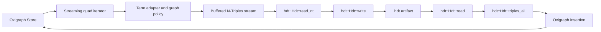

# RDF-HDT Implementation Plan

This document plans RDF-HDT import/export for the local Oxigraph-backed DocIndex
backend. It deliberately delivers the streaming bridge first, then evaluates a
direct bulk-builder API in `hdt-rs`.

## Scope and Constraints

The current backend stores RDF in `pyoxigraph.Store` and creates an in-memory
store when no remote URL or persistent storage path is configured. See
[oxirs.py](../src/docindex/src/docindex-core/src/docindex_core/backends/oxirs.py#L36-L82).
Static export currently iterates the store's quads, formats each subject,
predicate, and object as N-Triples, and returns one large `bytes` value
([oxirs.py](../src/docindex/src/docindex-core/src/docindex_core/backends/oxirs.py#L118-L127)).
The Sphinx hook writes that data to `docindex.nt` and probes for an optional HDT
encoder ([hooks.py](../src/docindex/src/docindex-sphinx/src/docindex_sphinx/hooks.py#L144-L164)).

The target crate is [`hdt`](https://docs.rs/hdt/latest/hdt/), currently version
`0.7.3`. Its public API can read HDT, read N-Triples with the experimental `nt`
feature, iterate triple patterns, write HDT, and write N-Triples. It does not
currently expose a public mutable HDT builder that accepts Oxigraph terms
directly.

The implementation must therefore distinguish these goals:

- **B:** eliminate Python materialization and temporary-file overhead with a
  streaming Rust bridge that connects Oxigraph output to `hdt-rs`.
- **C:** remove the RDF serialization and reparsing step by adding or adopting a
  public bulk-builder API in `hdt-rs`.

HDT is a triple format, while Oxigraph can contain named quads. Full named-graph
round-tripping is out of scope for the first version and must not be implied by
the API.

## Proposed Architecture



The B implementation keeps the `hdt-rs` public API unchanged. It uses a
Rust-side buffered stream and avoids the current Python `list[str]`, joined
string, and temporary-file path. C replaces the `NT` and `ReadNT` stages with a
direct `Hdt::from_triples`-style builder if that API becomes available.

## Phase B: Streaming Rust Bridge

### B1. Create a small Rust adapter

Add a focused Rust crate under `src/docindex`, preferably as a standalone
library plus command-line binary. Pin the dependency and enable only the
features needed for the first bridge:

```toml
[dependencies]
hdt = { version = "0.7.3", default-features = false, features = ["nt"] }
```

The adapter should expose these operations:

```text
export_hdt(input_ntriples, output_hdt)
import_hdt(input_hdt, output_target)
```

The first CLI can use paths or stdin/stdout. A library API should use
`Read`/`Write` so the Python integration can eventually use pipes without
creating an intermediate file.

### B2. Export from Oxigraph without Python materialization

Add a Rust-side Oxigraph iterator adapter that:

1. Iterates Oxigraph triples or quads.
2. Applies the named-graph policy.
3. Converts Oxigraph terms to valid N-Triples lexical forms.
4. Writes through a `BufWriter` or pipe.
5. Feeds the stream to the `hdt-rs` N-Triples reader.
6. Writes the resulting `Hdt` to the destination with `Hdt::write`.

The adapter must not sort or canonicalize N-Triples before handing them to
`hdt-rs`; HDT construction owns dictionary and triple ordering. Stable ordering
should be a separate option only if reproducible byte output is required.

For the current Python backend, use one of these boundaries:

- Preferred initial boundary: invoke the Rust helper with a stream or a local
  source file and destination file.
- Later optimization: expose the bridge through PyO3/maturin and pass encoded
  buffers or an iterator-backed callback.

The Python backend should add `dump_hdt(path)` and retain `dump_ntriples()` for
browser fallback. It should report capability errors distinctly from data
errors.

### B3. Import HDT into Oxigraph

Implement the inverse operation:

1. Open the HDT file with `hdt::Hdt::read` or `read_from_path` when the cache
   feature is intentionally enabled.
2. Iterate `triples_all()` for bulk loading, not one pattern query per triple.
3. Convert HDT string terms to Oxigraph named nodes, blank nodes, or literals.
4. Insert triples in batches into Oxigraph.
5. Return the imported triple count and elapsed time.

Term conversion needs explicit tests for:

- IRIs
- blank nodes
- plain literals
- language-tagged literals
- typed literals
- escaped Unicode and control characters

A malformed term must fail the import with a useful error rather than being
silently converted to an IRI.

### B4. Named-graph policy

Add an explicit configuration field, for example:

```text
OXIRS_HDT_NAMED_GRAPH_POLICY=reject|flatten
```

Use `reject` by default for general import/export APIs. Permit `flatten` for the
existing static DocIndex artifact, but log that graph identity was discarded.
Do not encode graph names into ordinary HDT triples without a documented
vocabulary and a corresponding import policy.

### B5. Sphinx integration

Update the existing static asset hook so that it can select the Rust bridge:

- Always retain `docindex.nt` as the guaranteed fallback.
- Prefer the Rust bridge when the helper is installed.
- Write `docindex.hdt` only after checking that it exists and is non-empty.
- Log triple count, N-Triples size, HDT size, and elapsed export time.
- Add an explicit required mode for CI or release builds, such as
  `docindex_rdf_hdt_required = True`.
- Keep optional mode for developer builds.

The current configuration already exposes HDT-related settings in
[conf.py](conf.py#L48-L73), while browser loading remains optional and falls
back to OxiRS WASM/N-Triples when no HDT module is configured
([docindex-search.js](_static/docindex-search.js#L92-L117)).

### B6. Packaging and CI

Add a reproducible build path for the Rust helper:

- Add `Cargo.toml` and `Cargo.lock` for the adapter.
- Document the minimum Rust toolchain required by the selected `hdt` release.
- Build the helper in CI and cache Cargo dependencies.
- Add a platform capability check to the Python package.
- Keep the helper optional for installations that only use remote search.
- Do not depend on an untracked system `rdf2hdt` or C++ HDT binary.

The documentation build should fail only when HDT is explicitly required. In
optional mode it should preserve the current N-Triples output and emit a clear
capability warning.

## Phase B Tests and Benchmarks

Add Rust tests for:

- N-Triples stream to HDT and back.
- HDT import into an empty Oxigraph store.
- Triple count preservation.
- RDF term preservation.
- Empty datasets.
- Invalid HDT and invalid N-Triples.
- Named-graph rejection and flattening.
- Repeated imports and exports.

Add Python tests near the existing backend tests in
[test_oxirs.py](../src/docindex/src/docindex-core/tests/test_oxirs.py#L1-L120):

- `dump_hdt()` creates a non-empty artifact.
- `load_hdt()` makes the expected documents searchable.
- Missing Rust helper produces a capability error.
- Optional mode falls back to N-Triples.
- Required mode fails when HDT export is unavailable.

Benchmark three implementations using the same generated dataset:

```text
A. Existing Python materialization -> N-Triples file
B. Rust streaming Oxigraph iterator -> hdt-rs N-Triples reader
C. Direct hdt-rs bulk builder
```

Record:

- wall-clock export time
- peak resident memory
- temporary disk usage
- N-Triples size
- HDT size
- HDT reload time
- Oxigraph import time
- query latency for fixed triple patterns

The B milestone is complete when it reduces peak memory and temporary I/O while
preserving all supported RDF terms and producing an HDT file that `hdt-rs` can
reload.

## Phase C: Direct Bulk Builder

### C1. Confirm the missing public API

Before implementing C, verify the selected `hdt` release's public API and
feature behavior. The current documented implementation has private dictionary
and triple-section construction details, so C may require an upstream change or
a maintained fork.

The desired API is conceptually:

```rust
Hdt::from_triples(
    triples: impl IntoIterator<Item = [String; 3]>
) -> Result<Hdt>
```

A more efficient API should avoid allocating three new strings when the source
terms can be borrowed or interned:

```rust
HdtBuilder::new()
    .insert(subject, predicate, object)?
    .finish()
```

The builder must define ownership, duplicate handling, ordering, invalid-term
behavior, and memory limits.

### C2. Implement dictionary and triple construction

If upstream accepts the feature, implement the builder in `hdt-rs` with these
properties:

1. Consume an iterator of RDF terms or an HDT-specific triple representation.
2. Intern shared, subject, predicate, and object terms without N-Triples
   escaping.
3. Build the dictionary sections in the format expected by the existing reader.
4. Sort or index triples according to the HDT section requirements.
5. Construct the bitmap/triple section.
6. Write through the existing `Hdt::write` method.
7. Preserve compatibility with files generated by the existing reader and
   supported HDT implementations.

The builder should be parallelizable only after the single-threaded version is
correct. A parallel dictionary build can reduce wall time but increases memory
and synchronization complexity.

### C3. Replace the B export path

Once the builder is available, change only the export half of the bridge:

```text
Oxigraph iterator
  -> direct HDT term adapter
  -> HdtBuilder
  -> Hdt::write
```

Keep B as a compatibility fallback. Runtime selection should be explicit or
capability-based, and the generated files from B and C must pass the same
round-trip and query tests.

### C4. Upstream contribution strategy

Prefer contributing the builder API to `hdt-rs` rather than maintaining private
fork patches. The upstream contribution should include:

- public builder documentation
- unit tests for RDF term classes
- round-trip tests against existing HDT fixtures
- benchmarks against `read_nt`
- feature-gated compilation behavior
- a clear statement of supported HDT variants

If upstream does not accept the API, keep the adapter on B and document that
HDT construction is intentionally streaming through the crate's N-Triples
reader.

## Browser WASM Follow-Up

The `hdt` crate documents experimental WebAssembly support, but compiled npm
artifacts are not supplied by the crate. Browser support should therefore be a
separate milestone after B or C:

1. Build the crate for `wasm32-unknown-unknown` with `wasm-pack`.
2. Publish or copy the generated module as a versioned static asset.
3. Expose a small browser API for loading an HDT file and querying triple
   patterns.
4. Configure `hdt_module` only when that artifact is present.
5. Retain OxiRS WASM/N-Triples fallback.
6. Add a small fixture test before attempting the production dataset.

Do not make browser HDT the only search path until the generated module has a
real Playwright test and a bounded load-time budget.

## Delivery Order

1. Add the Rust adapter and prove B on a small fixture.
2. Add Oxigraph import/export methods and term-policy validation.
3. Add Sphinx capability detection, required/optional modes, and metrics.
4. Add Python, Rust, and documentation-build tests.
5. Benchmark A versus B on the generated DocIndex dataset.
6. Decide whether B is fast enough for production.
7. If required, implement and upstream C as an `hdt-rs` bulk-builder API.
8. Replace B export with C behind a capability flag and retain B fallback.
9. Build and test browser WASM support separately.

## Acceptance Criteria

B is accepted when:

- Oxigraph data exports to a valid HDT file without Python-side list
  materialization.
- HDT imports into Oxigraph with supported RDF terms preserved.
- Named-graph behavior is explicit and tested.
- N-Triples fallback remains available.
- The docs build can require HDT in CI and remain optional locally.
- Benchmarks report memory, time, and artifact sizes.

C is accepted only when:

- A public, versioned `hdt-rs` builder exists.
- Direct construction is measurably faster or smaller than B on representative
  data.
- B and C produce mutually readable HDT files.
- The builder has upstream-compatible tests and documentation.
- No private assumptions about `hdt-rs` internal dictionary structures remain in
  the application adapter.

## Risks and Decisions

- **HDT is immutable:** use it for compact distribution and read-heavy search,
  not as a mutable replacement for Oxigraph.
- **HDT is triple-only:** named-graph identity needs an explicit policy.
- **Crate features are experimental:** pin versions and test with and without
  `sophia`, `nt`, `cache`, and `sparql` as applicable.
- **Memory can move rather than disappear:** B removes Python and temporary-file
  overhead, but `hdt-rs` still builds dictionaries and indexes in memory.
- **Canonical output is not required:** do not sort N-Triples unless reproducible
  bytes are a release requirement.
- **Browser artifacts are separate:** native Rust support does not automatically
  provide a browser decoder.
